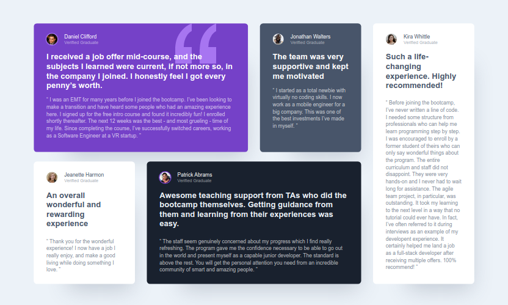

# Frontend Mentor - Testimonials grid section solution

This is a solution to the [Testimonials grid section challenge on Frontend Mentor](https://www.frontendmentor.io/challenges/testimonials-grid-section-Nnw6J7Un7). Frontend Mentor challenges help you improve your coding skills by building realistic projects.

## Table of contents

-   [Overview](#overview)
    -   [The challenge](#the-challenge)
    -   [Screenshot](#screenshot)
    -   [Links](#links)
-   [My process](#my-process)
    -   [Built with](#built-with)
    -   [What I learned](#what-i-learned)
    -   [Useful resources](#useful-resources)
-   [Author](#author)
-   [Acknowledgments](#acknowledgments)

## Overview

### The challenge

Users should be able to:

-   View the optimal layout for the site depending on their device's screen size

### Screenshot

### Links

-   Solution URL: [https://www.frontendmentor.io/solutions/mobile-first-approach-for-building-a-testimonial-grid-using-html-and-css-CSe1OzjcQ](https://www.frontendmentor.io/solutions/mobile-first-approach-for-building-a-testimonial-grid-using-html-and-css-CSe1OzjcQ)
-   Live Site URL: [https://ameyadeokule.github.io/testimonials-grid-section/](https://ameyadeokule.github.io/testimonials-grid-section/)

## My process

### Built with

-   ReactJS
-   SASS
-   Semantic HTML5 markup
-   CSS custom properties
-   CSS Grid
-   Mobile-first workflows

### What I learned

-   Using sudo-selectors
-   Targeting components using nth-child selector
-   Expanding a component over 2 grids

### Useful resources

-   [Use SASS in React.js](https://medium.com/how-to-react/use-sass-in-react-js-bbeb0b94f8a6) - Helped to understand the process of adding SASS to a React project using node-sass.

-   [CSS Tricks for Grid](https://css-tricks.com/snippets/css/complete-guide-grid/) - Helped to understand CSS grid fragments.

-   [A Complete Guide to CSS Media Queries](https://css-tricks.com/a-complete-guide-to-css-media-queries/) - This is an amazing article which helped me finally understand breakpoints and how to handle HTML elements on a much smaller screen using CSS media queries.

## Author

-   Name - [Ameya Deokule]
-   Frontend Mentor - [@ameyadeokule](https://www.frontendmentor.io/profile/ameyadeokule)

## Acknowledgments

I would like thank Kethmar Salumets [@developerhabits](https://twitter.com/developerHabits) for encouraging me to start completing challenges on Frontend Mentor.
